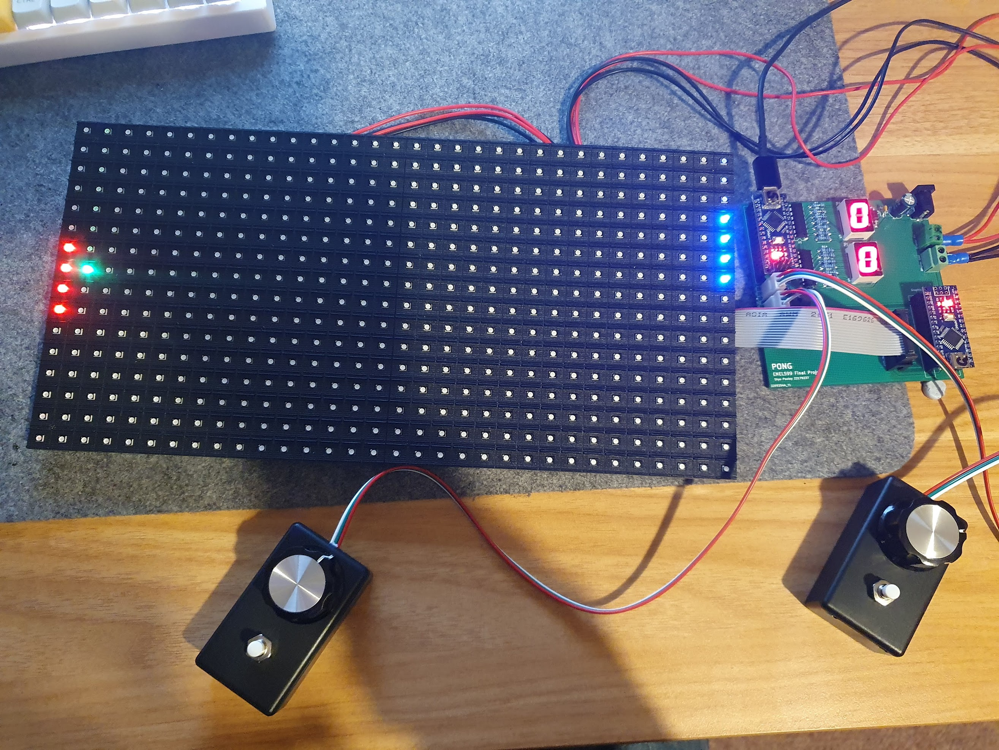

# Pong Game on Arduino LED Matrix

Recreation of Atari's *home pong* game system which plays a game of pong on a 64x32 LED matrix.  
This repository includes my schematics, PDB designs, and C++ code for the microcontrollers.
The PCB is designed for manufacturing with JLCPCB in two layers, exported files are included.

Due to memory constraints the functions of the system are split between two microcontrollers, one of which runs the game and IO while the other drives the display.
